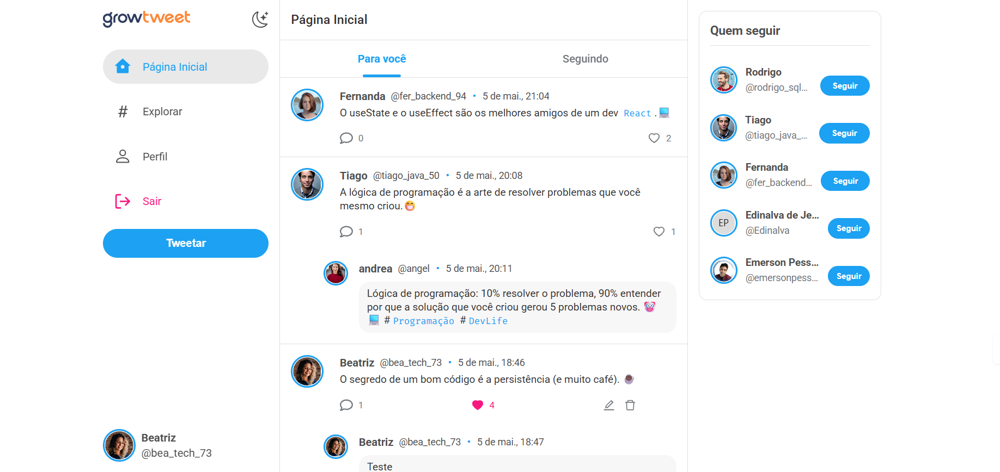

# 🚀 Growtwitter - Full Stack Project


Uma aplicação completa inspirada no X (Twitter), desenvolvida durante o bootcamp da Growdev, com foco em arquitetura moderna de front-end, tipagem forte e experiência do usuário.

---

## 🌐 Demonstração

| Camada                  | Link                                                                                             |
| ----------------------- | ------------------------------------------------------------------------------------------------ |
| 🖥️ Frontend             | [growtweet-app](https://growtwitter-app-alpha.vercel.app/)                                       |
| ⚙️ Backend API          | [growtweet-api](https://growtwitter-api-xi.vercel.app/users)                                     |
| 📖 Documentação Swagger | [api-docs](https://growtwitter-api-syq8.onrender.com/api-docs/)                                  |
| 📦 Repositório API      | [github.com/emersonpessoa01/growtwitter-api](https://github.com/emersonpessoa01/growtwitter-api) |

> Esta aplicação consome a **Growtwitter API** — uma REST API construída com Node.js, responsável por autenticação, tweets, likes, replies e followers.  
> Acesse o repositório da API para instruções de instalação e documentação dos endpoints.

---

## 📸 Preview

> 💡 Tela do app logado



---

## 🧠 Arquitetura & Conceitos

- Componentização avançada com React
- Gerenciamento de estado via Context API
- Separação de responsabilidades (services, components, pages)
- Interceptação de requisições com Axios
- Tipagem forte com TypeScript
- Sistema de temas (Dark/Light)
- Consumo de API REST externa via Axios com interceptors de token

---

## 📦 Tecnologias

### 🖥️ Frontend

| Camada      | Tecnologia        |
| ----------- | ----------------- |
| Frontend    | React + Vite      |
| Tipagem     | TypeScript        |
| Estilização | Styled Components |
| Roteamento  | React Router DOM  |
| HTTP Client | Axios             |
| UI/UX       | Lucide React      |

### ⚙️ Backend (API)

| Camada         | Tecnologia      |
| -------------- | --------------- |
| Runtime        | Node.js         |
| Framework      | Express         |
| Banco de Dados | PostgreSQL      |
| ORM            | Prisma          |
| Autenticação   | JWT             |
| Documentação   | Swagger UI      |
| Deploy         | Render + Vercel |

> 📌 Consulte o repositório da API: [growtwitter-api](https://github.com/emersonpessoa01/growtwitter-api)

---

## ⚙️ Funcionalidades

- 🔐 Autenticação completa (login/cadastro)
- 📰 Feed dinâmico com tweets
- 💬 Sistema de replies
- ❤️ Curtidas (likes)
- 👤 Perfil do usuário
- 🌍 Página explorar
- 👥 Sistema de followers reais
- 🌙 Dark Mode / ☀️ Light Mode
- 📱 Layout totalmente responsivo

---

## 💡 Diferencial Técnico

> Implementação de sistema de **followers reais**, substituindo o modelo básico de comentários.

Esta implementação é baseada em uma abordagem de **componentização mais complexa**, que envolve a criação de **componentes de alto nível** que podem ser reutilizados em diferentes partes do aplicativo.

- Relacionamentos mais complexos
- Manipulação de estado mais robusta
- Maior proximidade com aplicações reais

---

## 📖 Documentação da API

A API possui documentação interativa gerada com **Swagger UI**, permitindo visualizar e testar todos os endpoints diretamente pelo navegador.

| Ambiente             | URL                                                                                               |
| -------------------- | ------------------------------------------------------------------------------------------------- |
| 🌐 Produção (Render) | [growtwitter-api-syq8.onrender.com/api-docs](https://growtwitter-api-syq8.onrender.com/api-docs/) |
| 💻 Local             | [localhost:3030/api-docs](http://localhost:3030/api-docs)                                         |

> 💡 Para testar os endpoints protegidos, faça login pela rota `/auth`, copie o token JWT retornado e clique em **Authorize** no Swagger para liberar o acesso.

---

## 🔗 Integração com a API

A comunicação com o backend é feita via **Axios** com interceptor automático de token JWT:

```ts
// src/services/api.ts
import axios from "axios";

export const api = axios.create({
  baseURL: import.meta.env.VITE_API_URL,
});

api.interceptors.request.use((config) => {
  const token = localStorage.getItem("@Growtwitter:token");
  if (token) {
    config.headers.Authorization = `Bearer ${token}`;
  }
  return config;
});
```

Configure o arquivo `.env` na raiz do projeto:

```env
VITE_API_URL=https://growtwitter-api-xi.vercel.app
```

---

## 🚀 Como executar

```bash
# Clone o projeto
git clone https://github.com/emersonpessoa01/growtwitter-app.git

# Acesse a pasta
cd growtwitter-app

# Instale dependências
npm install

# Configure o .env
cp .env.example .env
# Edite o VITE_API_URL com a URL da API

# Execute
npm run dev
```

Acesse: http://localhost:5173

---

## 🗄️ Populando o Banco de Dados (Seed)

Para facilitar os testes e a visualização da interface, este projeto utiliza um script de seed. Ele popula o banco de dados Neon com usuários iniciais (como Beatriz, Rodrigo, Tiago, Fernanda, Andrea, Edinalva, Emerson, Growdev e outros foram criados a partir da tela do cadastro), garantindo que o feed e a lista "Quem seguir" não fiquem vazios no primeiro acesso.

Para rodar o seed, acesse a pasta do backend e execute na raiz do projeto growtwitter-api:

```bash
npx prisma db seed
```

> [!IMPORTANT]
>
> As senhas de todos os usuários do seed são: **senha123**.
>
> As senhas são armazenadas como hash utilizando bcrypt para garantir a segurança e o funcionamento correto do login.

---

## 📱 Responsividade

| Breakpoint              | Layout                                       |
| ----------------------- | -------------------------------------------- |
| Desktop (> 1024px)      | 3 colunas: sidebar + feed + widgets          |
| Tablet (768px – 1024px) | 2 colunas: sidebar + feed                    |
| Mobile (< 768px)        | Feed em tela cheia + navegação inferior fixa |

---

## 📁 Estrutura do Projeto

```text
src/
├── assets/
├── components/
│   ├── Button/
│   ├── Spinner/
│   ├── TweetCard/
│   ├── TweetModal/
│   └── WhoToFollow/
├── contexts/
│   └── AuthContext.tsx
├── Global/
├── layouts/
│   └── DefaultLayout.tsx
├── pages/
│   ├── Explorer/
│   ├── Home/
│   ├── Login/
│   ├── Profile/
│   ├── Signup/
│   └── UserProfile/
├── services/
│   └── api.ts
├── themes/
├── types/
├── styled.d.ts
└── App.tsx
```

---

## 🧪 Possíveis Melhorias

- [ ] Testes com Jest ou Vitest
- [ ] Sistema de notificações em tempo real (WebSocket)
- [ ] Upload de imagens de perfil
- [ ] Infinite scroll no feed
- [ ] PWA (Progressive Web App)
- [ ] Pesquisa de tweets e usuários

---

## 🤝 Contribuição

1. Fork o projeto
2. Crie uma branch: `git checkout -b feature/minha-feature`
3. Commit: `git commit -m 'feat: minha feature'`
4. Push: `git push origin minha-feature`
5. Abra um Pull Request

---

## 📄 Licença

Este projeto está sob licença MIT.

---

## 👨‍💻 Autor

**Emerson Pessoa**  
[](https://www.linkedin.com/in/emersonpessoa01/)
[](https://github.com/emersonpessoa01)

Full Stack Developer  
_"Bring me to life... in code!"_ 🤘

---

📅 Atualizado em: 06/05/2026
